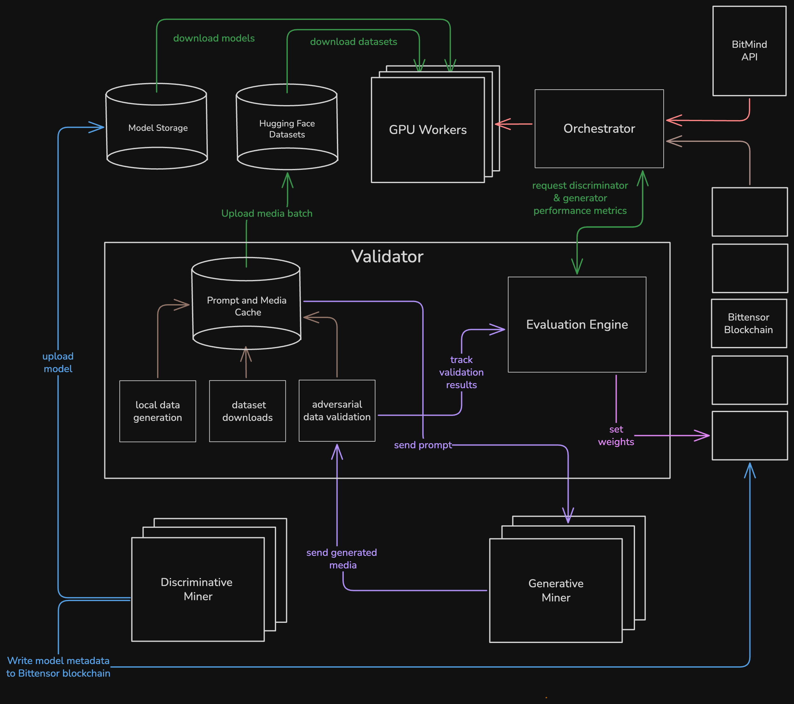
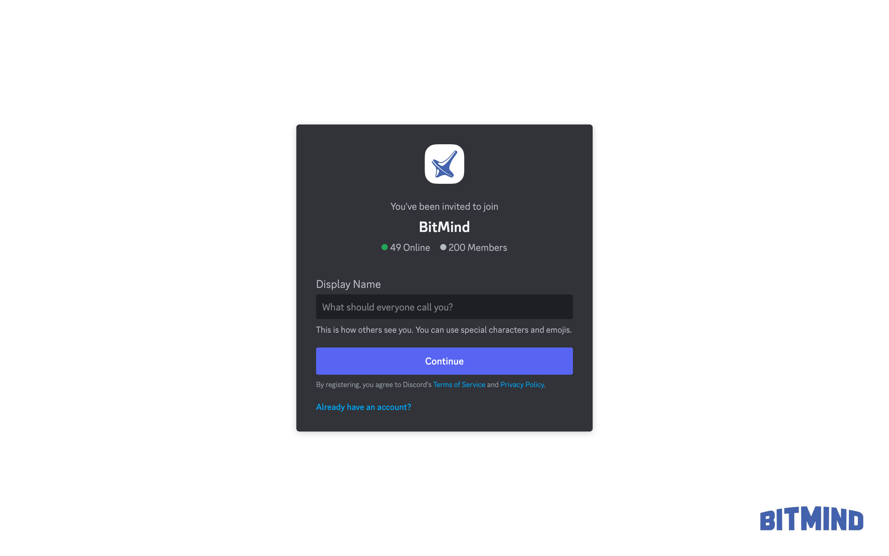

<div align="center">
  
  
  <h1>GAS<br><small>Generative Adversarial Subnet</small></h1>
  <h3><code>Bittensor SN34</code></h3>
  <p>
    <a href="docs/Mining.md">⛏️ Mining</a> ·
    <a href="docs/Validating.md">🛡️ Validating</a> ·
    <a href="docs/Incentive.md">💰 Incentives</a> ·
    <a href="https://app.bitmind.ai/statistics">🏆 Leaderboard</a>
  </p>
  
  <p>
    <a href="https://wandb.ai/bitmindai/subnet-379-validator">📊 W&B Mainnet 34 (coming soon)</a> ·
    <a href="https://wandb.ai/bitmindai/subnet-379-validator">📊 W&B Testnet 379</a>
  </p>

  <p>
    <a href="https://www.bitmind.ai/apps">🌐 Apps</a> ·
    <a href="https://huggingface.co/bitmind">🤗 HF</a>
  </p>
</div>

## About GAS
<div align="center">
<em>Fake content is evolving fast. Staying ahead demands relentless innovation.</em><br><br>
</div>

**GAS (Generative Adversarial Subnet)** is a Bittensor subnet inspired by Generative Adversarial Networks (GANs). Detectors and generators compete in a dynamic loop: detectors sharpen their ability to spot synthetic media, while generators push to create more convincing fakes. This adversarial process drives cutting-edge detection tools and continuously generates the training data needed to sustain progress.

Unlike static AI safety solutions, GAS thrives on open, incentivized competition, ensuring detectors evolve as fast as the threats they face.


## Quick Start

### Installation

```bash
git clone <repository-url>
cd GAS
./install.sh
```

**Options:**
- `./install.sh --no-system-deps` - Skip system dependency installation (intended for discriminative miners)

### Using gascli
```bash
# Activate virtual environment to use gascli
source .venv/bin/activate

# Show available commands
gascli --help

# Validators: Start or restart validator services
gascli validator start

# Miners: Push discriminator models
gascli miner push-discriminator --onnx-dir /path/to/models --wallet-name default --hotkey-name default
```

**Available Aliases:**
- `validator` → `vali`, `v`
- `miner` → `m`

### Not using gascli
```bash
# Validators: Start or restart validator services
# (Does not require virtualenv activation)
pm2 start validator.config.js  

# Miners: Push discriminator models
source .venv/bin/activate
python neurons/discriminator/push_model.py --onnx-dir /path/to/models --wallet-name default --hotkey-name default
```
For detailed installation and usage instructions, see [Installation Guide](docs/Installation.md).


## Core Components

> This documentation assumes basic familiarity with [Bittensor concepts](https://docs.bittensor.com/learn/bittensor-building-blocks). 

#### Discriminative Miners [[docs](docs/Discriminative-Mining.md)]
Discriminative miners submit detection models for evaluation against a wide variety of real and synthetic media and are rewarded based on their accuracy. This differs from previous versions of SN34, where discriminative miners hosted hardware to serve both validator challenges and organic API traffic. This both significantly reduces the capital required to mine, and allows the subnet to more reliably identiy unique models and reward novel contributions proportionally to their accuracy rather than the speed of their registration script. 


#### Generative Miners [[docs](docs/Generative-Mining.md)]

 (*coming soon*)

Generative miners generate and modify media according to prompts generated by validators, and are rewarded based on their ability to pass validation checks and fool discrimintive miners.

#### Validators [[docs](docs/Validating.md)]
Validators are responsible for challenging and scoring both miner types. Generative miners are sent prompts, and their returned synthetic media are validated to mitigate gaming and incentivize high quality results. Discriminative miners are continually evaluated against a mix of data from generative miners, real world data, and data generated locally on the validator.


## Subnet Architecture


## Community

<p align="left">
  <a href="https://discord.gg/kKQR98CrUn">
    
  </a>
</p> 
