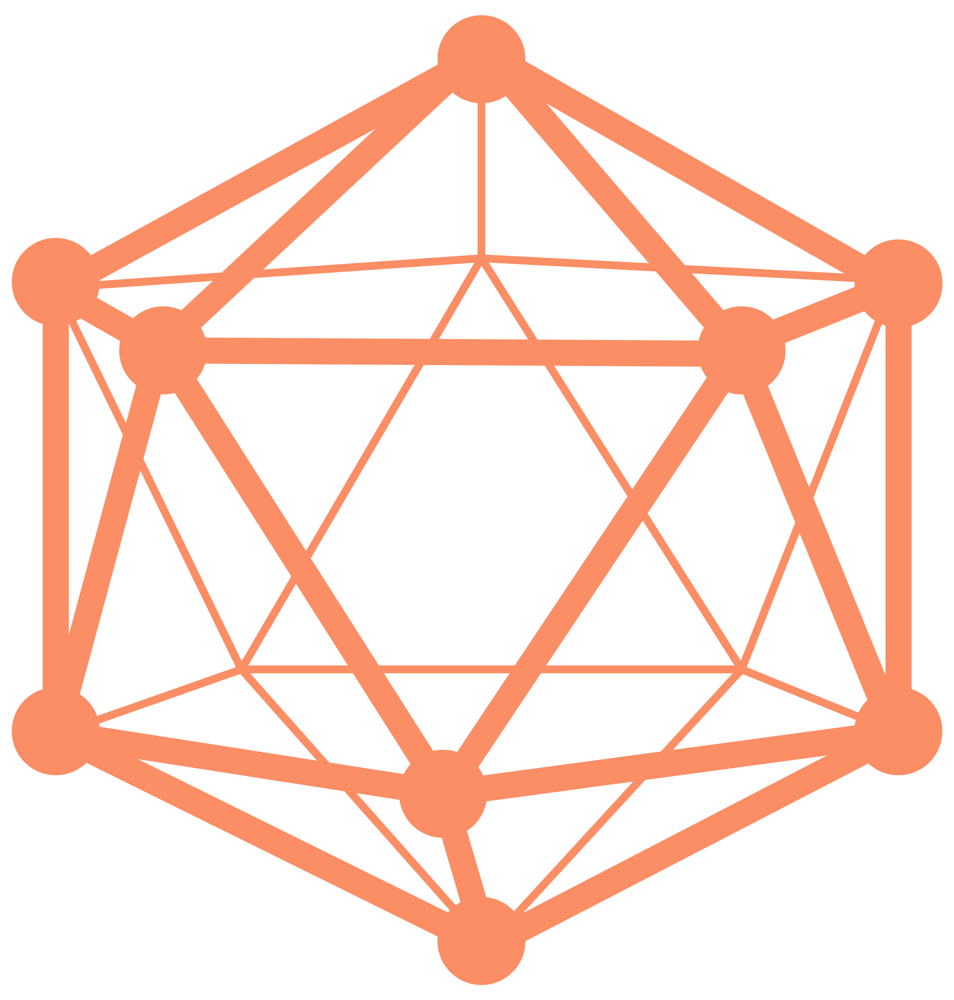
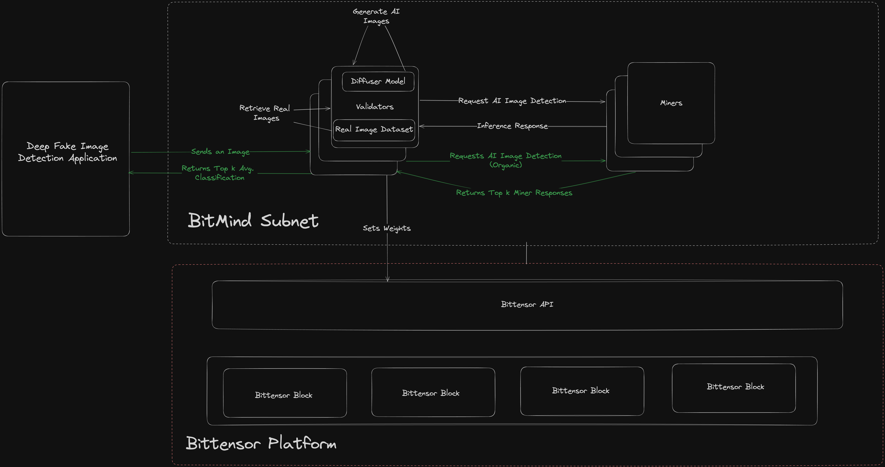
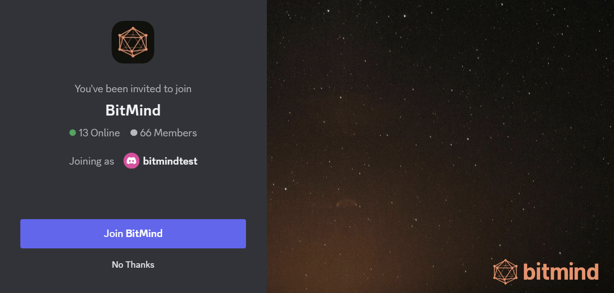

# Bitmind Subnet


## Table of Contents

- [Introduction 💡](#introduction)
- [Project Structure and Terminology 📖](#project-structure-and-terminology)
- [Setup 🔧](#setup)
- [Mining ⛏️](#mining)
- [Validating 🔎](#validating)
- [License 📄](#license)

## Introduction

**IMPORTANT**: If you are new to Bittensor, we recommend familiarizing yourself with the basics on the [Bittensor Website](https://bittensor.com/) before proceeding to the [Setup](#setup) section.

### Identifying AI-Generated Media with a Decentralized Framework

**Overview:**
The BitMind Subnet leverages advanced generative and discriminative AI models within the Bittensor network to detect AI-generated images. This platform is engineered on a decentralized, incentive-driven framework to enhance trustworthiness and stimulate continuous technological advancement.

**Purpose:**
The proliferation of generative AI models has significantly increased the production of high-quality synthetic media, presenting challenges in distinguishing these from authentic content. The BitMind Subnet addresses this challenge by providing robust detection mechanisms to maintain the integrity of digital media.

**Features:**
- **API and Frontend (Coming Soon):** Accessibility will be broadened through an intuitive API and user interface, facilitating the integration and utilization of our detection technologies.
- **Model Evolution:** Our platform continuously integrates the latest research and developments in AI to adapt to evolving generative techniques.

**Core Components:**
- **Miners:** Tasked with running binary classifiers that discern between genuine and AI-generated content.
    - **Foundation Model:** Based on the insights from the 2024 CVPR paper [*Rethinking the Up-Sampling Operations in CNN-based Generative Network for Generalizable Deepfake Detection*](https://arxiv.org/abs/2312.10461), our primary model utilizes Neighborhood Pixel Relationships to detect specific discrepancies in AI-generated images.
    - **Research Integration:** We systematically update our detection models and methodologies in response to emerging academic research, offering resources like training codes and model weights to our community.
- **Validators:** Responsible for challenging miners with a balanced mix of real and synthetic images, drawn from a diverse pool of sources.
    - **Resource Expansion:** We are committed to enhancing the validators' capabilities by increasing the diversity and volume of the image pool, which supports rigorous testing and validation processes.

**Contribution:**
Developers and researchers are invited to contribute to the BitMind Subnet, whether by participating in model development, contributing to codebases, or engaging with our community. Your involvement helps improve the efficacy of digital media verification technologies.

**Stay Updated:**
For upcoming features and community updates, please follow our project repository and join our discussions.



We are currently in testnet phase, uid 168.

## Join Our Discord Community

<p align="left">
  <a href="https://discord.gg/bitmind">
    
  </a>
</p>

For real-time discussions, community support, and regular updates, join our Discord server. Connect with developers, researchers, and users to get the most out of BitMind Subnet.

## Project Structure and Terminology

### Overview and Terminology

Before diving into the specifics of the directory structure and key components, let's familiarize ourselves with the essential terms used throughout this project. Understanding these terms is crucial for navigating and contributing to the BitMind Subnet effectively. For a more detailed explanation of the terminology, please refer to [Bittensor Building Blocks](https://docs.bittensor.com/learn/bittensor-building-blocks).

- **Synapse**: Acts as a communication bridge between axons (servers) and dendrites (clients), facilitating data flow and processing.
- **Neuron**: A fundamental unit that includes both an axon and a dendrite, enabling full participation in the network operations.

### Notable Directories

- **bitmind/**: This directory contains the specific implementations of Bittensor operations, which include the key components such as miners, validators, and neurons.
  - **base/**: Houses base classes for miner, validator, and neuron functionalities, each inheriting from the broader Bittensor framework.

### Key Files and Descriptions

#### bitmind/base/
- **miner.py**: Responsible for loading models and weights, and handling predictions on images.
- **validator.py**: Implements core functionality for generating challenges for miners, scoring responses, and setting weights.
- **neuron.py**: A class that inherits from the base miner class provided by Bittensor, incorporating both axon and dendrite functionalities.

#### bitmind/validator/
- **forward.py**: Manages image processing and synapse operations using `ImageSynapse` for 256x256 images. Includes logic for challenge issuance and reward updates based on performance.
- **proxy.py**: Temporarily unused; intended for handling frontend requests.

#### bitmind/miner/
- **predict.py**: Handles image transformation and the execution of model inference.

### Datasets

- **real_fake_dataset**: Utilized by the base miner for training, distinguishing between real and fake images.

### Additional Tools

- **random_image_generator.py**: A class that uses a prompt generation model and a suite of diffusion models to produce synthetic images. Supports caching of image/prompt pairs to a local directory.

## Setup

### Before you proceed

**Ensure you are running Subtensor locally** to minimize outages and improve performance. See [Run a Subtensor Node Locally](https://github.com/opentensor/subtensor/blob/main/docs/running-subtensor-locally.md#compiling-your-own-binary).

**Be aware of the minimum compute requirements** for our subnet, detailed in [Minimum compute YAML configuration](./min_compute.yml). A GPU is recommended for training, although not required for basic inference.

### Installation

To install system dependencies like `pm2`, run our install script:
```bash
chmod +x install_system_deps.sh
./install_system_deps.sh
```

We recommend using a Conda virtual environment to install the necessary Python packages.<br>
You can set up Conda with this [quick command-line install](https://docs.anaconda.com/free/miniconda/#quick-command-line-install), and create a virtual environment with this command:
```bash
conda create -y -n bitmind python=3.10 ipython
```

To activate your virtual environment, run `conda activate bitmind`. To deactivate, `conda deactivate`.

Download the repository, navigate to the folder and then install the necessary requirements with the following chained command.

```bash
git clone https://github.com/bitmind-ai/bitmind-subnet.git && cd bitmind-subnet
conda activate bitmind
export PIP_NO_CACHE_DIR=1
pip install -e .
```

### Data

You can download the necessary datasets by running:

```bash
python download_data.py
```

- For **validators**, we recommend you do this prior to registering and running your validator. The download can take up to a few hours. Please note the minimum storage requirements specified in `min_compute.yml`. 

- For **miners**, this is only necessary when training a new model. Deployed miner instances do not need access to these datasets. 


### Registration

We are currenlty on testnet. To mine or validate on our subnet, must have a registered hotkey on subnet 168 on testnet.

```bash
btcli s register --netuid 168 --wallet.name [wallet_name] --wallet.hotkey [wallet.hotkey] --subtensor.network test
```

---

## Mining

You can launch your miners via pm2 using the following command. To stop your miner, you can run `pm2 delete miner`.

```bash
pm2 start ./neurons/miner.py --name miner --interpreter $CONDA_PREFIX/bin/python3 -- --netuid XX --subtensor.network <LOCAL/FINNEY/TEST> --wallet.name <WALLET NAME> --wallet.hotkey <HOTKEY NAME> --axon.port <PORT>
```

**Testnet Example**:

```bash
pm2 start ./neurons/miner.py --name miner --interpreter $CONDA_PREFIX/bin/python3 -- --neuron.model_path ./mining_models/miner.pth --netuid 168 --subtensor.network test --wallet.name default --wallet.hotkey default --axon.port 8091
```


## Validating

You can launch your validator via pm2 using the following command. To stop your validator, you can run `pm2 delete validator`.

```bash
pm2 start ./neurons/validator.py --name validator --interpreter $CONDA_PREFIX/bin/python3 -- --netuid XX --subtensor.network <LOCAL/FINNEY/TEST> --wallet.name <WALLET NAME> --wallet.hotkey <HOTKEY NAME>
```

**Testnet Example**:

```bash
pm2 start ./neurons/validator.py --name validator --interpreter  $CONDA_PREFIX/bin/python3 -- --netuid 168 --subtensor.network test --wallet.name default --wallet.hotkey default
```

---

## Train

To train a model, you can start with our base training script. If you prefer a notebook environment, you can use `base_miner/train_detector.ipynb`
```python
cd base_miner && python train_detector.py
```
- The model with the lowest validation accuracy will be saved to `base_miner/checkpoints/<experiment_name>/model_epoch_best.pth`.<br>
- Once you've trained your model, you can evaluate its performance and inspect its predictions in `base_miner/eval_detector.ipynb`.<br>
- To see performance improvements, you'll need to train on more data, modify hyperparameters, or try a different modeling strategy altogether. Happy experimenting!


#### Tensorboard
Training metrics are logged with TensorboardX. You can view interactive graphs of these metrics by starting a tensorboard server with the following command, and navigating to `localhost:6006`.

```bash
tensorboard --logdir=./base_miner/checkpoints/<experiment_name>
```

If you're using remote compute for training, you can set up port forwarding by ssh'ing onto your machine with the following flags:
```bash
ssh -L 7007:localhost:6006 your_username@your_ip
```
with port forwarding enabled, you can start your tensorboard server on your remote machine with the following command, and view the tensorboard UI at `localhost:7007` in your local browser.
```bash
tensorboard --logdir=./base_miner/checkpoints/<experiment_name> --host 0.0.0.0 --port 6006
```


#### Update Miner Detector Model

The most straightforward way to deploy a new miner is by stopping its associated pm2 process (`pm2 delete miner`) and starting it again, setting the `--neuron.model_path` argument appropriately.

Another approach, which avoids avoids miner downtime, is to replace the model file.

1. Optionally make a backup of the currently active model:
   ```bash
   cp mining_models/miner.pth mining_models/miner_backup.pth
   ```
2. Replace the currently active model with your newly trained one. The next forward pass of your miner will load the new model without a restart.
   ```bash
   cp path/to/your/trained/model_epoch_best.pth mining_models/miner.pth
   ```

## Predict
- Prediction logic specific to the trained model your miner is hosting resides in `bitmind/miner/predict.py`
- If you train a custom model, or change the `base_transforms` used in training (defined in `bitmind.image_transforms`) you may need to update `predict.py` accordingly.
- Miners return a single float between 0 and 1, where a value above 0.5 represents a prediction that the image is fake.
- Rewards are based on accuracy. The reward from each challenge is binary.


---

## License

This repository is licensed under the MIT License.

```text
# The MIT License (MIT)
# Copyright © 2023 Yuma Rao

# Permission is hereby granted, free of charge, to any person obtaining a copy of this software and associated
# documentation files (the “Software”), to deal in the Software without restriction, including without limitation
# the rights to use, copy, modify, merge, publish, distribute, sublicense, and/or sell copies of the Software,
# and to permit persons to whom the Software is furnished to do so, subject to the following conditions:

# The above copyright notice and this permission notice shall be included in all copies or substantial portions of
# the Software.

# THE SOFTWARE IS PROVIDED “AS IS”, WITHOUT WARRANTY OF ANY KIND, EXPRESS OR IMPLIED, INCLUDING BUT NOT LIMITED TO
# THE WARRANTIES OF MERCHANTABILITY, FITNESS FOR A PARTICULAR PURPOSE AND NONINFRINGEMENT. IN NO EVENT SHALL
# THE AUTHORS OR COPYRIGHT HOLDERS BE LIABLE FOR ANY CLAIM, DAMAGES OR OTHER LIABILITY, WHETHER IN AN ACTION
# OF CONTRACT, TORT OR OTHERWISE, ARISING FROM, OUT OF OR IN CONNECTION WITH THE SOFTWARE OR THE USE OR OTHER
# DEALINGS IN THE SOFTWARE.
```
