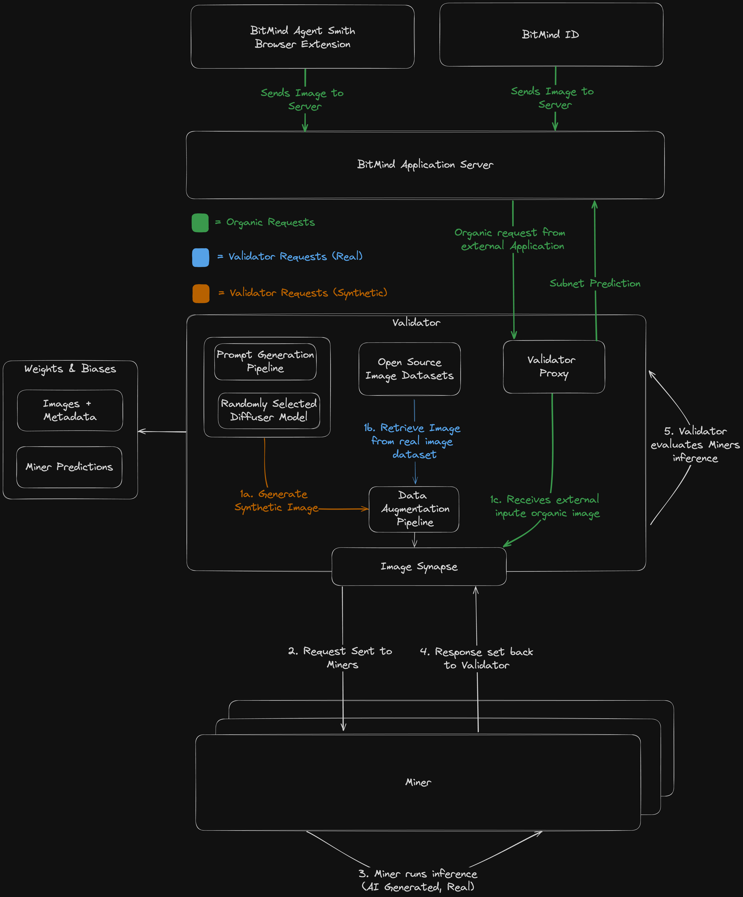

<center>
    
</center>

# BitMind Subnet (Bittensor Subnet 34)


Welcome to the BitMind Subnet! This repository contains all the necessary information to get started, contribute, and understand our architecture.

## Quick Links

- [Mining Guide 🔨](docs/Mining.md)
- [Validator Guide 🔧](docs/Validating.md)
- [Project Structure and Terminology 📖](docs/Glossary.md)
- [Contributor Guide 🤝](docs/Contributor_Guide.md)

**IMPORTANT**: If you are new to Bittensor, we recommend familiarizing yourself with the basics on the [Bittensor Website](https://bittensor.com/) before proceeding to the [Setup Guide](docs/Setup.md) page.

## Identifying AI-Generated Media with a Decentralized Framework

**Overview:**
The BitMind Subnet leverages advanced generative and discriminative AI models within the Bittensor network to detect AI-generated images. This platform is engineered on a decentralized, incentive-driven framework to enhance trustworthiness and stimulate continuous technological advancement.

**Purpose:**
The proliferation of generative AI models has significantly increased the production of high-quality synthetic media, presenting challenges in distinguishing these from authentic content. The BitMind Subnet addresses this challenge by providing robust detection mechanisms to maintain the integrity of digital media.

**Features:**

- **API and Frontend (Coming Soon):** Accessibility will be broadened through an intuitive API and user interface, facilitating the integration and utilization of our detection technologies.
- **Model Evolution:** Our platform continuously integrates the latest research and developments in AI to adapt to evolving generative techniques.

**Core Components:**

- **Miners:** Tasked with running binary classifiers that discern between genuine and AI-generated content.
  - **Foundation Model:** Based on the insights from the 2024 CVPR paper [_Rethinking the Up-Sampling Operations in CNN-based Generative Network for Generalizable Deepfake Detection_](https://arxiv.org/abs/2312.10461), our primary model utilizes Neighborhood Pixel Relationships to detect specific discrepancies in AI-generated images.
  - **Research Integration:** We systematically update our detection models and methodologies in response to emerging academic research, offering resources like training codes and model weights to our community.
- **Validators:** Responsible for challenging miners with a balanced mix of real and synthetic images, drawn from a diverse pool of sources.
  - **Resource Expansion:** We are committed to enhancing the validators' capabilities by increasing the diversity and volume of the image pool, which supports rigorous testing and validation processes.

**Subnet Architecture Diagram**


## Community

<p align="left">
  <a href="https://discord.gg/bitmind">
    
  </a>
</p>

For real-time discussions, community support, and regular updates, join our Discord server. Connect with developers, researchers, and users to get the most out of BitMind Subnet.

## License

This repository is licensed under the MIT License.

```text
# The MIT License (MIT)
# Copyright © 2023 Yuma Rao

# Permission is hereby granted, free of charge, to any person obtaining a copy of this software and associated
# documentation files (the “Software”), to deal in the Software without restriction, including without limitation
# the rights to use, copy, modify, merge, publish, distribute, sublicense, and/or sell copies of the Software,
# and to permit persons to whom the Software is furnished to do so, subject to the following conditions:

# The above copyright notice and this permission notice shall be included in all copies or substantial portions of
# the Software.

# THE SOFTWARE IS PROVIDED “AS IS”, WITHOUT WARRANTY OF ANY KIND, EXPRESS OR IMPLIED, INCLUDING BUT NOT LIMITED TO
# THE WARRANTIES OF MERCHANTABILITY, FITNESS FOR A PARTICULAR PURPOSE AND NONINFRINGEMENT. IN NO EVENT SHALL
# THE AUTHORS OR COPYRIGHT HOLDERS BE LIABLE FOR ANY CLAIM, DAMAGES OR OTHER LIABILITY, WHETHER IN AN ACTION
# OF CONTRACT, TORT OR OTHERWISE, ARISING FROM, OUT OF OR IN CONNECTION WITH THE SOFTWARE OR THE USE OR OTHER
# DEALINGS IN THE SOFTWARE.
```
