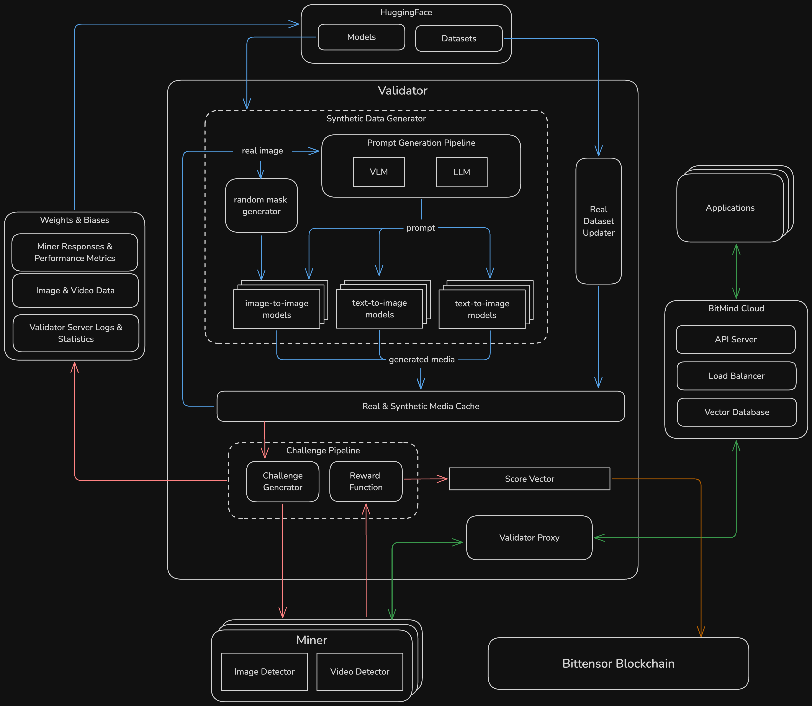

  

<h1 align="center">SN34 <small>Deepfake Detection</small></h1>

 <a href="https://www.bitmind.ai/apps">Applications</a>

 <a href="docs/Mining.md">Mining Guide</a> ·
 <a href="docs/Validating.md">Validator Guide</a> ·
  <a href="docs/Incentive.md">Incentive Mechanism Overview</a>

 <a href="https://huggingface.co/bitmind">HuggingFace</a> ·
 <a href="https://wandb.ai/bitmindai/bitmind-subnet">Mainnet 34 W&B</a> ·
 <a href="https://wandb.ai/bitmindai/bitmind-subnet">Testnet 168 W&B</a>

 <a href="https://app.bitmind.ai/statistics">Leaderboard</a>

## Decentralized Detection of AI Generated Content
The explosive growth of generative AI technology has unleashed an unprecedented wave of synthetic media creation. AI-generated audiovisual content has become remarkably sophisticated, oftentimes indistinguishable from authentic media. This development presents a critical challenge to information integrity and societal trust in the digital age, as the line between real and synthetic content continues to blur.

To address this growing challenge, SN34 aims to create the most accurate fully-generalized detection system. Here, fully-generalized means that the system is capable of detecting both synthetic and semi-synthetic media with high degrees of accuracy regardless of their content or what model generated them. Our incentive mechanism evolves alongside state-of-the-art generative AI, rewarding miners whose detection algorithms best adapt to new forms of synthetic content.

## Core Components

> This documentation assumes basic familiarity with [Bittensor concepts](https://docs.bittensor.com/learn/bittensor-building-blocks). 

<b><a href="docs/Mining.md">Miners</a></b>

- Miners are tasked with running binary classifiers that discern between genuine and AI-generated content, and are rewarded based on their accuracy. 
- For each challenge, a miner is presented an image or video and is required to respond with a multiclass prediction [$p_{real}$, $p_{synthetic}$, $p_{semisynthetic}$] indicating whether the media is real, fully generated, or partially modified by AI.

<b><a href="docs/Validating.md">Validators</a></b>
- Validators challenge miners with a balanced mix of real and synthetic media drawn from a diverse pool of sources.
- We continually add new datasets and generative models to our validators in order to evolve the subnet's detection capabilities alongside advances in generative AI. 

## Subnet Architecture

Overview of the validator neuron, miner neuron, and other components external to the subnet.

<b>Challenge Generation and Scoring (Peach Arrows)</b>

<ul>
  <li>The validator first randomly samples an image or video from its local media cache.</li>
  <li>The sampled media can be real, synthetic, or semisynthetic, and was either downloaded from an dataset on Huggingface or generated locally by one of many generative models.</li>
  <li>The sampled media is then augmented by a pipeline of random transformations, adding to the challenge difficulty and mitigating incentive mechanism gaming via lookups.</li>
  <li>The augmented media is then sent to miners for classification.</li>
  <li>The validator scores the miners responses and logs comprehensive challenge results to <a href="https://wandb.ai/bitmindai/bitmind-subnet">Weights and Biases</a>, including the generated media, original prompt, miner responses and rewards, and other challenge metadata.</li>
</ul>

<b>Data Generation and Downloads (Blue Arrows)</b>

The blue arrows show how the validator media cache is maintained by two parallel tracks:
<ul>
<li>The synthetic data generator coordinates a VLM and LLM to generate prompts for our suite of text-to-image, image-to-image, and text-to-video models. Each generated image/video is written to the cache along with the prompt, generation parameters, and other metadata.</li>
<li>The real data fetcher performs partial dataset downloads, fetching random compressed chunks of datasets from HuggingFace and unpacking random portions of these chunks into the cache along with their metadata. Partial downloads avoid requiring TBs of space for large video datasets like OpenVid1M.</li>
</ul>

<b>Organic Traffic (Green Arrows)</b>

<a href="https://www.bitmind.ai/apps">Application</a> requests are distributed to validators by an API server and load balancer in BitMind's cloud. A vector database caches subnet responses to avoid uncessary repetitive calls coming from salient images on the internet. 

## Community

  

