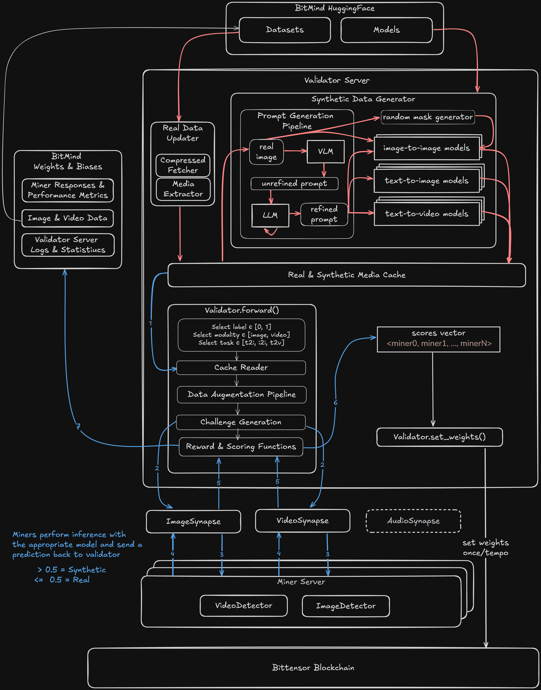

<p align="center">
  
</p>
<h1 align="center">BitMind Subnet<br>Bittensor Subnet 34 | Deepfake Detection</h2


The BitMind Subnet leverages advanced generative and discriminative AI models within the Bittensor network to detect AI-generated images and videos. 

## Quick Links
- [Mining Guide ⛏️](docs/Mining.md)
- [Validator Guide 🔧](docs/Validating.md)
- [Architecture Diagrams 🏗️](#Subnet-Architecture)
- [Incentive Mechanism 📈](docs/Incentive.md)
- [Project Structure and Terminology 📖](docs/Glossary.md)
- [Contributor Guide 🤝](docs/Contributor_Guide.md)

## Decentralized Detection of AI Generated Content
Rapid advancements in generative AI have led to a massive proliferation of synthetic media that is increasingly difficult to distinguish from authentic content, posing significant challenges for the integrity of digital information and the trust that underpins modern society.

To address this growing challenge, SN34 aims to create the most accurate fully-generalized detection system. Here, fully-generalized means that the system is capable of detecting both synthetic and semi-synthetic media from all known generative architectures. Our incentive mechanism evolves alongside state-of-the-art generative AI, rewarding miners whose detection algorithms are the most accurate across all cutting-edge generative models.


## Core Components

**Miners** 
- Miners are tasked with running binary classifiers that discern between genuine and AI-generated content, and are rewarded based on their accuracy. 
- Miners predict a float value in [0., 1.], with values greater than 0.5 indicating the image or video is AI generated. 
- Miners are rewarded based on their accuracy.


**Validators** 
- Validators challenge miners with a balanced mix of real and synthetic media drawn from a diverse pool of sources
- We continuously add new datasets and generative models to our validators in order to maximize the coverage of the types of media miners are incentivized to detect. 

## Subnet Architecture


*Overview of all main subnet components*<br>
*Green arrows: Organic traffic flows*<br>
*Blue arrows: validator challenge generation and scoring*


*Detailed breakdown of all validator components*<br>
*Pink arrows: Asynchronous data generation and download flows*<br>
*Blue arrows: Validator challenge generation and scoring*

## The BitMind Platform

The [BitMind platform](https://app.bitmindlabs.ai/) offers a best-in-class developer experience for Bittensor miners. 

⚡ **Access Compute**: We offer a wide variety of CPU and GPU options<br>
⚡ **Develop in VSCode**: Develop in a feature-rich IDE (we support Jupyter too if you hate rich features)<br>
⚡ **Fully Managed Devops:** No more tinkering with networking configuration - register and deploy your miner in just a few clicks <br>
⚡ **Monitor Emissions:** View the emissions for all of your miners in our Miner Dashboard

## Community

<p align="left">
  <a href="https://discord.gg/kKQR98CrUn">
    
  </a>
</p>

For real-time discussions, community support, and regular updates, <a href="https://discord.gg/kKQR98CrUn">join our Discord server</a>. Connect with developers, researchers, and users to get the most out of BitMind Subnet.

## License

This repository is licensed under the MIT License.

```text
# The MIT License (MIT)
# Copyright © 2023 Yuma Rao

# Permission is hereby granted, free of charge, to any person obtaining a copy of this software and associated
# documentation files (the “Software”), to deal in the Software without restriction, including without limitation
# the rights to use, copy, modify, merge, publish, distribute, sublicense, and/or sell copies of the Software,
# and to permit persons to whom the Software is furnished to do so, subject to the following conditions:

# The above copyright notice and this permission notice shall be included in all copies or substantial portions of
# the Software.

# THE SOFTWARE IS PROVIDED “AS IS”, WITHOUT WARRANTY OF ANY KIND, EXPRESS OR IMPLIED, INCLUDING BUT NOT LIMITED TO
# THE WARRANTIES OF MERCHANTABILITY, FITNESS FOR A PARTICULAR PURPOSE AND NONINFRINGEMENT. IN NO EVENT SHALL
# THE AUTHORS OR COPYRIGHT HOLDERS BE LIABLE FOR ANY CLAIM, DAMAGES OR OTHER LIABILITY, WHETHER IN AN ACTION
# OF CONTRACT, TORT OR OTHERWISE, ARISING FROM, OUT OF OR IN CONNECTION WITH THE SOFTWARE OR THE USE OR OTHER
# DEALINGS IN THE SOFTWARE.
```
