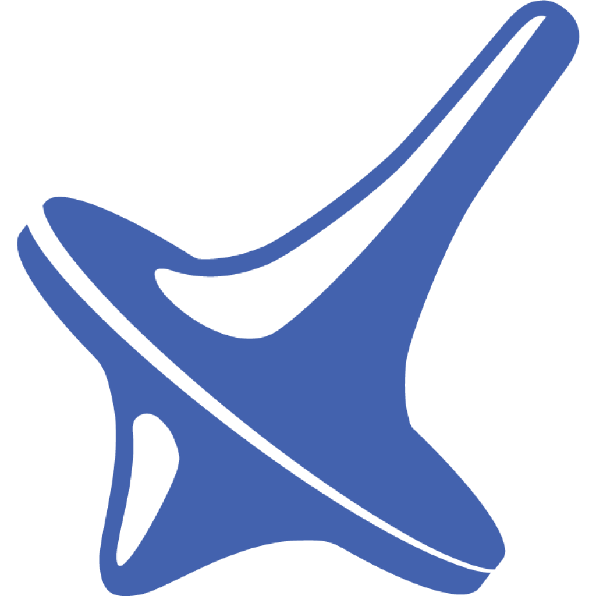

<p align="center">
  
</p>
<h1 align="center">BitMind Subnet (Bittensor Subnet 34)<br>Deepfake Detection</h1>


## Quick Links

- [Mining Guide ⛏️](docs/Mining.md)
- [Validator Guide 🔧](docs/Validating.md)
- [Incentive Mechanism 📈](docs/Incentive.md)
- [Project Structure and Terminology 📖](docs/Glossary.md)
- [Contributor Guide 🤝](docs/Contributor_Guide.md)

## Identifying AI-Generated Media with a Decentralized Framework

- **Applications:** See [our applications page](https://www.bitmindlabs.ai/apps) for a list of applications built on the BitMind Subnet to detect AI-generated media
  - [Agent Smith Browser Extension](https://chromewebstore.google.com/detail/bitmind-agent-smith/ejlhmbdnjjlifeeelpnlkkechnmojnhg)
  - [BitMind ID](https://bitmindid.com/)
  - [BitMind X Bot](https://x.com/bitmindbot)
  - [BitMind Discord Bot Invite Link](https://discord.com/oauth2/authorize?client_id=1274036214361620560&permissions=139586825408&integration_type=0&scope=bot+applications.commands)

**IMPORTANT**: If you are new to Bittensor, we recommend familiarizing yourself with the basics on the [Bittensor Website](https://bittensor.com/) before proceeding.

**Overview:**
The BitMind Subnet leverages advanced generative and discriminative AI models within the Bittensor network to detect AI-generated images and videos. 

**Purpose:**
As generative AI technology advances rapidly, the creation of sophisticated synthetic media has become increasingly prevalent and accessible. This surge in AI-generated content poses significant challenges for content authenticity and digital trust. The BitMind Subnet enables reliable identification of AI-generated media, helping preserve the authenticity and credibility of digital content across the internet.

**Features:**

- **Infinitely Fine-Tunable:** Our incentive mechanism evolves alongside state-of-the-art generative AI, rewarding only miners whose detection algorithms account for the latest models

**Core Components:**

- **Miners** Tasked with running binary classifiers that discern between genuine and AI-generated content.
  - Predict a float value in [0., 1.], with predictions > 0.5 indicating the image or video is AI-generated
  - Miners run both a image detection model and a video detection model 

- **Validators:** Responsible for challenging miners with a balanced mix of real and synthetic media, drawn from a diverse pool of sources.
  - We continuously add new datasets and generative models to our validators in order to maximize the coverage of the types of media our miners are incentivized to detect. 

**Subnet Architecture Diagram**


## The BitMind Platform

The [BitMind platform](https://app.bitmindlabs.ai/) offers a best-in-class developer experience for Bittensor miners. 

⚡ **Access Compute**: We offer a wide variety of CPU and GPU options<br>
⚡ **Develop in VSCode**: Develop in a feature-rich IDE (we support Jupyter too if you hate rich features)<br>
⚡ **Fully Managed Devops:** No more tinkering with networking configuration - register and deploy your miner in just a few clicks <br>
⚡ **Monitor Emissions:** View the emissions for all of your miners in our Miner Dashboard

## Community

<p align="left">
  <a href="https://discord.gg/bitmind">
    
  </a>
</p>

For real-time discussions, community support, and regular updates, <a href="https://discord.gg/bitmind">join our Discord server</a>. Connect with developers, researchers, and users to get the most out of BitMind Subnet.

## License

This repository is licensed under the MIT License.

```text
# The MIT License (MIT)
# Copyright © 2023 Yuma Rao

# Permission is hereby granted, free of charge, to any person obtaining a copy of this software and associated
# documentation files (the “Software”), to deal in the Software without restriction, including without limitation
# the rights to use, copy, modify, merge, publish, distribute, sublicense, and/or sell copies of the Software,
# and to permit persons to whom the Software is furnished to do so, subject to the following conditions:

# The above copyright notice and this permission notice shall be included in all copies or substantial portions of
# the Software.

# THE SOFTWARE IS PROVIDED “AS IS”, WITHOUT WARRANTY OF ANY KIND, EXPRESS OR IMPLIED, INCLUDING BUT NOT LIMITED TO
# THE WARRANTIES OF MERCHANTABILITY, FITNESS FOR A PARTICULAR PURPOSE AND NONINFRINGEMENT. IN NO EVENT SHALL
# THE AUTHORS OR COPYRIGHT HOLDERS BE LIABLE FOR ANY CLAIM, DAMAGES OR OTHER LIABILITY, WHETHER IN AN ACTION
# OF CONTRACT, TORT OR OTHERWISE, ARISING FROM, OUT OF OR IN CONNECTION WITH THE SOFTWARE OR THE USE OR OTHER
# DEALINGS IN THE SOFTWARE.
```
