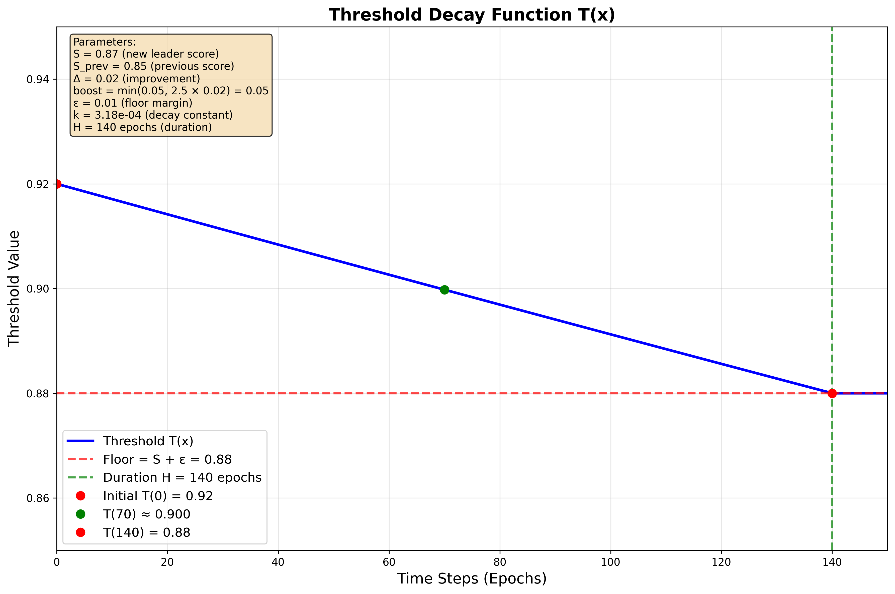

# Incentive Mechanism

## Benchmark Runs
Submitted discriminator miners are evaluated against a subset of the data sources listed below. A portion of the evaluation data comes from generative miners, who are rewarded based on their ability to submit data that both pass validator sanity checks (prompt alignment, etc.) and fool discriminators in benchmark runs.

<strong>Evaluation Datasets</strong>

### Image Datasets

**Real Images:**
- [drawthingsai/megalith-10m](https://huggingface.co/datasets/drawthingsai/megalith-10m)
- [bitmind/bm-eidon-image](https://huggingface.co/datasets/bitmind/bm-eidon-image)
- [bitmind/bm-real](https://huggingface.co/datasets/bitmind/bm-real)
- [bitmind/open-image-v7-256](https://huggingface.co/datasets/bitmind/open-image-v7-256)
- [bitmind/celeb-a-hq](https://huggingface.co/datasets/bitmind/celeb-a-hq)
- [bitmind/ffhq-256](https://huggingface.co/datasets/bitmind/ffhq-256)
- [bitmind/MS-COCO-unique-256](https://huggingface.co/datasets/bitmind/MS-COCO-unique-256)
- [bitmind/AFHQ](https://huggingface.co/datasets/bitmind/AFHQ)
- [bitmind/lfw](https://huggingface.co/datasets/bitmind/lfw)
- [bitmind/caltech-256](https://huggingface.co/datasets/bitmind/caltech-256)
- [bitmind/caltech-101](https://huggingface.co/datasets/bitmind/caltech-101)
- [bitmind/dtd](https://huggingface.co/datasets/bitmind/dtd)
- [bitmind/idoc-mugshots-images](https://huggingface.co/datasets/bitmind/idoc-mugshots-images)

**Synthetic Images:**
- [bitmind/JourneyDB](https://huggingface.co/datasets/bitmind/JourneyDB)
- [bitmind/GenImage_MidJourney](https://huggingface.co/datasets/bitmind/GenImage_MidJourney)
- [bitmind/bm-aura-imagegen](https://huggingface.co/datasets/bitmind/bm-aura-imagegen)
- [bitmind/bm-imagine](https://huggingface.co/datasets/bitmind/bm-imagine)
- [Yejy53/Echo-4o-Image](https://huggingface.co/datasets/Yejy53/Echo-4o-Image)

**Semi-synthetic Images:**
- [bitmind/face-swap](https://huggingface.co/datasets/bitmind/face-swap)

### Video Datasets

**Real Videos:**
- [bitmind/bm-eidon-video](https://huggingface.co/datasets/bitmind/bm-eidon-video)
- [shangxd/imagenet-vidvrd](https://huggingface.co/datasets/shangxd/imagenet-vidvrd)
- [nkp37/OpenVid-1M](https://huggingface.co/datasets/nkp37/OpenVid-1M)
- [facebook/PE-Video](https://huggingface.co/datasets/facebook/PE-Video)

**Semi-synthetic Videos:**
- [bitmind/semisynthetic-video](https://huggingface.co/datasets/bitmind/semisynthetic-video)

**Synthetic Videos:**
- [Rapidata/text-2-video-human-preferences-veo3](https://huggingface.co/datasets/Rapidata/text-2-video-human-preferences-veo3)
- [Rapidata/text-2-video-human-preferences-veo2](https://huggingface.co/datasets/Rapidata/text-2-video-human-preferences-veo2)
- [bitmind/aura-video](https://huggingface.co/datasets/bitmind/aura-video)
- [bitmind/aislop-videos](https://huggingface.co/datasets/bitmind/aislop-videos)

<strong>Generative Models</strong>

The following models run by validators to produce a continual, fresh stream of synthetic and semisynthetic data. The outputs of these models are uploaded at regular intervals to public datasets in the [GAS-Station](https://huggingface.co/gasstation) Hugging Face org for miner training and evaluation.

### Text-to-Image Models

- [stabilityai/stable-diffusion-xl-base-1.0](https://huggingface.co/stabilityai/stable-diffusion-xl-base-1.0)
- [SG161222/RealVisXL_V4.0](https://huggingface.co/SG161222/RealVisXL_V4.0)
- [Corcelio/mobius](https://huggingface.co/Corcelio/mobius)
- [prompthero/openjourney-v4](https://huggingface.co/prompthero/openjourney-v4)
- [cagliostrolab/animagine-xl-3.1](https://huggingface.co/cagliostrolab/animagine-xl-3.1)
- [runwayml/stable-diffusion-v1-5](https://huggingface.co/runwayml/stable-diffusion-v1-5) + [Kvikontent/midjourney-v6](https://huggingface.co/Kvikontent/midjourney-v6) LoRA
- [black-forest-labs/FLUX.1-dev](https://huggingface.co/black-forest-labs/FLUX.1-dev)
- [DeepFloyd/IF](https://huggingface.co/DeepFloyd/IF)
- [deepseek-ai/Janus-Pro-7B](https://huggingface.co/deepseek-ai/Janus-Pro-7B)
- [THUDM/CogView4-6B](https://huggingface.co/THUDM/CogView4-6B)

### Image-to-Image Models

- [diffusers/stable-diffusion-xl-1.0-inpainting-0.1](https://huggingface.co/diffusers/stable-diffusion-xl-1.0-inpainting-0.1)
- [Lykon/dreamshaper-8-inpainting](https://huggingface.co/Lykon/dreamshaper-8-inpainting)

### Text-to-Video Models

- [tencent/HunyuanVideo](https://huggingface.co/tencent/HunyuanVideo)
- [genmo/mochi-1-preview](https://huggingface.co/genmo/mochi-1-preview)
- [THUDM/CogVideoX-5b](https://huggingface.co/THUDM/CogVideoX-5b)
- [ByteDance/AnimateDiff-Lightning](https://huggingface.co/ByteDance/AnimateDiff-Lightning)
- [Wan-AI/Wan2.2-TI2V-5B-Diffusers](https://huggingface.co/Wan-AI/Wan2.2-TI2V-5B-Diffusers)

### Image-to-Video Models

- [THUDM/CogVideoX1.5-5B-I2V](https://huggingface.co/THUDM/CogVideoX1.5-5B-I2V) 

 

## Generator Rewards

The generator incentive mechanism combines two components: a base reward for passing data validation checks, and a multiplier based on adversarial performance against discriminators.

### Base Reward (Data Validation)

Generators receive a base reward based on their data verification pass rate:

$$R_{\text{base}} = p \cdot \min(n, 10)$$

Where:
- $p$ = pass rate (proportion of generated content that passes validation)
- $n$ = number of verified samples (`min(p, 10)` creates a rampup of incentive for the first 10 samples)

### Fool Rate Multiplier (Adversarial Performance)

Generators earn additional rewards by successfully fooling discriminators. The multiplier is calculated as:

$$M = \max(0, \min(2.0, f \cdot s))$$

Where:
- $f$ = fool rate = $\frac{N_{\text{fooled}}}{N_{\text{fooled}} + N_{\text{not fooled}}}$
- $s$ = sample size multiplier

The sample size multiplier encourages generators to be evaluated on more samples, similar to the sample size ramp used in the base reward.

$$s = \begin{cases}
\max(0.5, \frac{c}{20}) & \text{if } c < 20 \\
\min(2.0, 1.0 + \ln(\frac{c}{20})) & \text{if } c \geq 20
\end{cases}$$

Where:
- $c$ = total evaluation count (fooled + not fooled)
- Reference count of 20 gives multiplier of 1.0
- Sample sizes below 20 are penalized
- Sample sizes above 20 receive logarithmic bonus up to 2.0x

### Final Generator Reward

The total generator reward combines both components:

$$R_{\text{total}} = R_{\text{base}} \cdot M$$

This design incentivizes generators to:
1. Produce high-quality, valid content (base reward)
2. Create adversarially robust content that can fool discriminators (multiplier)
3. Participate in more evaluations for sample size bonuses

## Discriminator Rewards

The discriminator incentive mechanism uses a winner-take-all approach with a dynamic threshold system that gradually decays over time. This ensures that only the best-performing discriminators receive rewards while maintaining competition over extended periods. Currently, scores are mean of image and video multiclass MCCs. In the future, this may be broken out into individual image and video thresholds. 

### Threshold Function

The threshold function $T(x)$ is defined as:

$$T(x) = \max \left( S + \varepsilon, (S + \text{boost}) e^{-kx} \right)$$

Where:
- $S$ = new leader's score (e.g., 0.87)
- $\varepsilon$ = floor margin (use 0.01 $\Rightarrow$ floor = $S + 0.01$)
- $\text{boost} = \min(\text{cap}, g \cdot \Delta)$, with $\Delta = S - S_{\text{prev}}$
  - pick $g = 2.5$ and $\text{cap} = 0.05$
  - (so a +0.02 improvement $\Rightarrow 2.5 \times 0.02 = 0.05 \Rightarrow$ full 5-point boost)
- We choose $k$ by duration (lands exactly on the floor at $H$ epochs):

$$k = \frac{1}{H} \ln \left( \frac{S + \text{boost}}{S + \varepsilon} \right)$$

- with $H = 140$ epochs (~1 week)

### Example

Using the scenario from the threshold calculation:
- $S_{\text{prev}} = 0.85$, $S = 0.87$, $\Delta = 0.02$
- $\text{boost} = \min(0.05, 2.5 \times 0.02) = 0.05 \Rightarrow$ initial $T(0) = 0.92$
- $\varepsilon = 0.01 \Rightarrow$ floor $= 0.88$
- $k = \frac{1}{140} \ln(0.92/0.88) \approx 3.17 \times 10^{-4}$
- Then $T(x)$ decays smoothly: $\sim 0.900$ around 70 epochs, and clamps to 0.88 at 140.

The following plot illustrates how the threshold function decays over time using the example parameters above:

