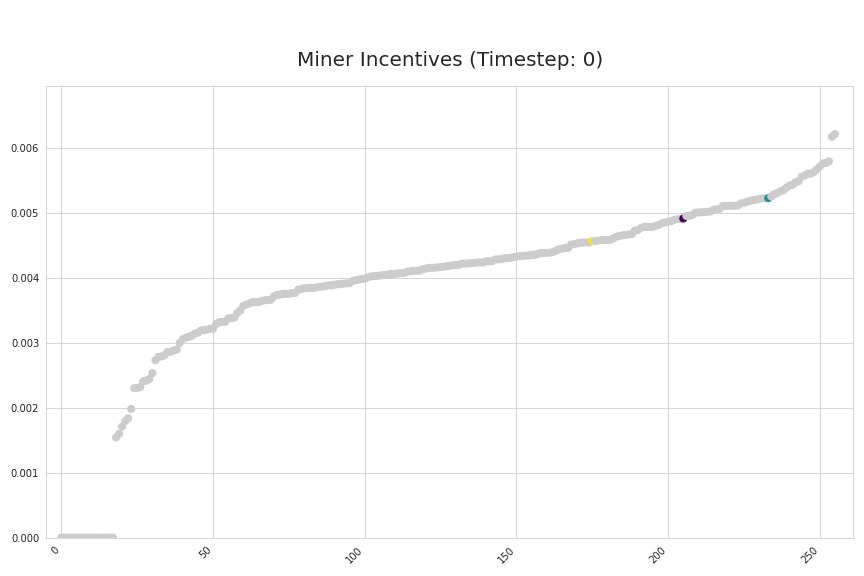

# Bitmind Subnet Incentive Mechanism

This document covers the current state of SN34's incentive mechanism. 
1. [Overview](#overview)
2. [Rewards](#rewards)
3. [Scores](#scores)
4. [Weights](#weights)
5. [Incentive](#incentives)

## TLDR

Miner rewards are a weighted combination of their performance on video and image detection challenges.

Performance on video and image challenges are computed separately -- each is a weighted combination of the MCC of the last 100 predictions and the accuracy of the last 10. 

Validators keep track of miner performance using a score vector, which is updated using an exponential moving average. The weights assigned by validators determine the distribution of rewards among miners, incentivizing high-quality predictions and consistent performance.

  

<em>Simulation applying our latest iteration of our incentive mechanism on historical subnet data. Note that this graphic shows incentive changes at a much more granular timescale (one timestep per challenge) than that of actual weight setting (once per 360 blocks) <a href=https://github.com/BitMind-AI/incentive-simulator>incentive-simulator repository</a>
</em>

## Rewards
> Total rewards are a weighted combination of video and image rewards. Rewards for both image and video challenges are the [Matthews Correlation Coefficient (MCC)](https://en.wikipedia.org/wiki/Phi_coefficient) of (up to) a miner's last 100 predictions, combined with the accuracy of their last 10. 

Total rewards

$$ 
C_{total} = 0.6 \cdot C_{image} + 0.4 \cdot C_{video} 
$$

Rewards for modality *m*

$$ 
C_m = 0.5 \cdot MCC_m + 0.5 \cdot Accuracy_m
$$

## Scores

>Validators set weights based on historical miner performances, tracked by their score vector. 

For each challenge *t*, a validator will randomly sample 50 miners, send them an image/video, and compute their rewards *C* as described above. These reward values are then used to update the validator's score vector *V* using an exponential moving average (EMA) with *&alpha;* = 0.02. 

$$
V_t = 0.02 \cdot C_t + 0.98 \cdot V_{t-1}
$$

A low *&alpha;* value places emphasis on a miner's historical performance, adding additional smoothing to avoid having a single prediction cause significant score fluctuations.

## Weights

> Validators set weights around once per tempo (360 blocks) by sending a normalized score vector to the Bittensor blockchain (in `UINT16` representation).

Weight normalization by L1 norm:

$$w = \frac{\text{V}}{\lVert\text{V}\rVert_1}$$

## Incentives
> The [Yuma Consensus algorithm](https://docs.bittensor.com/yuma-consensus) translates the weight matrix *W* into incentives for the subnet miners and dividends for the subnet validators

Specifically, for each miner *j*, incentive is a function of rank *R*:

$$I_j = \frac{R_j}{\sum_k R_k}$$

where rank *R* is *W* (a matrix of validator weight vectors) weighted by validator stake vector *S*. 

$$R_k = \sum_i S_i \cdot W_{ik}$$

